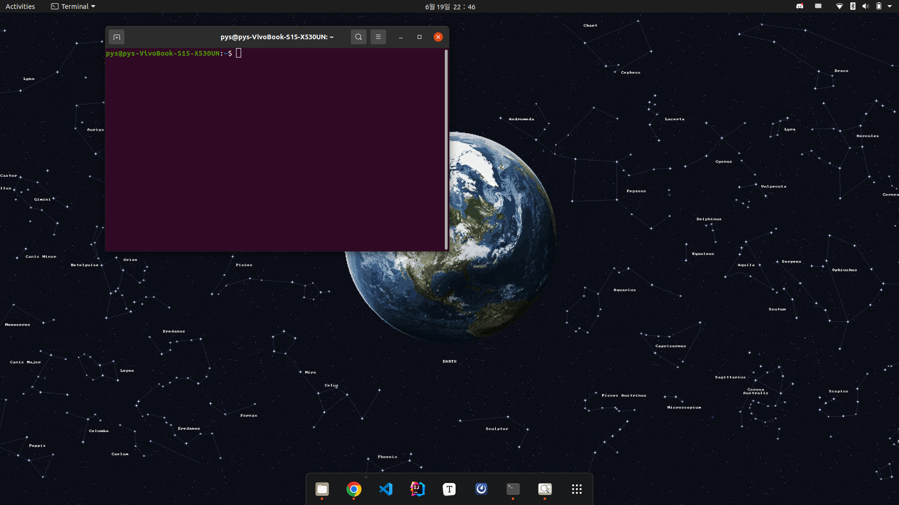
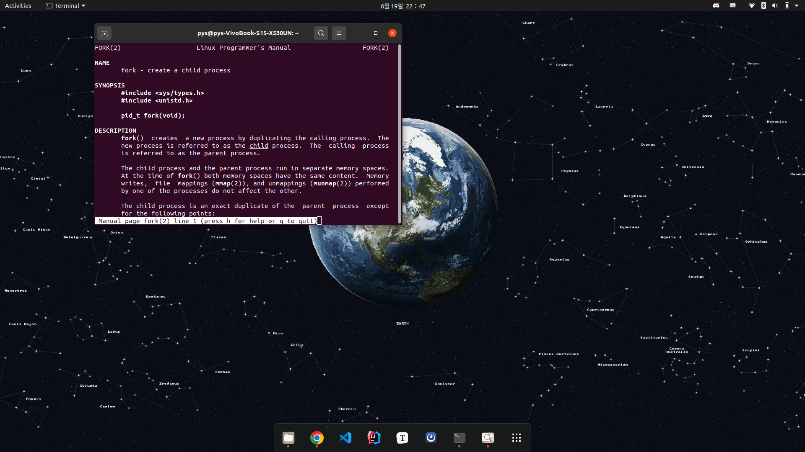

# Ch04.Process Management

# 실습 1. 프로세스의 생성과 종료

## 목차

```
1. 프로세스 생성
	- 부모 프로세스로부터 자식 프로세스를 생성해보자 + 기본 팁
	- 자식 프로세스에서 외부 프로그램을 실행해보자
	- 자식 프로세스가 완료될 때까지 부모 프로세스를 기다리게 해보자
2. 프로세스 종료
	- 자식 프로세스가 스스로 꺼지도록 종료해보자
	- 부모 프로세스에서 자식 프로세스를 강제 종료시켜보자
```

## 1. 프로세스의 생성 (2023. 06. 20)

프로세스는 부모로부터 자식이 만들어지는, 트리 형태의 계층 구조를 이루고 있습니다.

부모 프로세스로부터 자식 프로세스들을 생성해보고, 각 프로세스의 진행은 어떻게 이루어지는지 확인해봅시다.

### 1-1. 부모 프로세스로부터 자식 프로세스를 생성해보자 + 기본 팁

프로세스의 생성은 `fork()` 시스템콜에 의해 이루어집니다. 다들 우분투를 설치하셨다면 ctrl + alt + t를 눌러 터미널을 열어봅시다.



리눅스에서는 이 `fork()`를 포함한 시스템 콜, 라이브러리 콜, 명령어 등에 대한 기본 매뉴얼을 제공하고 있는데, 이 매뉴얼은 `man` 명령어를 통해서 열 수 있습니다. `fork()`의 세부 매뉴얼을 보기 위해 `man fork`를 입력해봅시다.



이 매뉴얼은 q를 눌러 끌 수 있습니다.

매뉴얼을 읽어보면 `fork()` 가 어떤 값을 리턴하고 어떤 기능을 하는 함수인지 쭉 나와있으니 이후의 실습에서도 참고하시길 바랍니다.

이후 실습은 Ubuntu에서도 VSCode를 설치할 수 있으니, VSCode를 사용해도 좋고, 터미널에서 VIM을 써도 됩니다.

---

우선 `fork()` 함수에 대해 알아보면 다음과 같습니다.

```c
#include <sys/types.h>
#include <unistd.h>
pid_t fork(void); //pid_t는 int값임
//Returns: 0 to child, PID of child to parent, −1 on error
```

`fork()` 는 자식 프로세스를 만드는 함수로 여러 특징들이 있는데, 그 중 하나는 바로 ************************************************************************************한 번 호출되지만 두 번 리턴한다************************************************************************************는 것입니다. `fork()` 함수는 부모 프로세스에서 한 번 호출되지만, 부모 프로세스에게는 자식 프로세스의 PID를, 자식 프로세스에게는 0을 리턴해 총 두 번 리턴합니다.

아래의 코드를 실행해봅시다.

```c
#include <sys/types.h>
#include <unistd.h>
#include <stdio.h>

int main(){
    int PID = fork();

    if (PID == 0){//PID가 0이면 자식 프로세스
        printf("I am child process. I got %d from fork() function\n", PID);
    }
    else if (PID > 0){//PID > 0이면 부모 프로세스. PID는 자식 프로세스의 PID
        printf("I am parent process. I got %d from fork() function\n", PID);
    }
}
```

이를 실행해보면 child process는 `fork()`로부터 0을 리턴받고, parent process는 `fork()`로부터 양의 정수 값을 리턴받았음을 확인할 수 있습니다. 그런데 이상한 점은 위 코드를 몇 번 실행해보면 출력의 순서가 뒤바뀌기도 한다는 점입니다.

```
(출력 예1)
I am parent process. I got value of 78411 from fork() function
I am child process. I got value of 0 from fork() function

(출력 예2)
I am child process. I got value of 0 from fork() function
I am parent process. I got value of 78411 from fork() function
```

이렇게 출력되는 것들의 순서가 일정하지 않은 이유는 `fork()`가 된 이후부터 부모 프로세스와 자식 프로세스는 **동시에 돌아가는** 별개의 프로세스가 되기 때문입니다.

---

`fork()` 의 두 번째 특징으로는, **자식 프로세스는 부모 프로세스를 복제하지만 그 둘은 별개의 메모리 공간을 차지한다**는 것입니다.

```c
#include <sys/types.h>
#include <unistd.h>
#include <stdio.h>

int main(){
    int PID = fork();
	int x = 123;

    if (PID == 0){//PID가 0이면 자식 프로세스
        x++;
        printf("I am child process. my x is %d\n", x);
    }
    else if (PID > 0){//PID > 0이면 부모 프로세스. PID는 자식 프로세스의 PID
        x--;
        printf("I am parent process. my x is %d\n", x);
    }
}
```

위 코드를 실행하면 자식 프로세스의 `x`는 124, 부모 프로세스의 `x`는 122가 됐음을 알 수 있습니다. 자식 프로세스는 123이라는 처음에는 부모의 `x` 값을 복제하지만 이후 둘은 별개의 메모리 공간을 가지는, 서로 다른 프로세스가 됐기 때문입니다. 

### 1-2. 자식 프로세스에서 외부 프로그램을 실행해보자
이번에는 `exec()` 시스템 콜에 대해서 알아봅시다. 터미널에서 `man exec` 명령어를 입력해보면 NAME에 많은 함수들이 있는데, 이들이 모두 `exec()` 계열의 함수들입니다. 그 중 하나인 `execve()`는 다음과 같습니다.  
```c
#include <unistd.h>
int execve(const char *filename, const char *argv[], const char *envp[]);
//Does not return if OK; returns −1 on error
```
`exec()`계열 함수들은 현재 프로세스에 기존에 있는 프로그램들을 올리고 실행하는 함수들로, 그 특징은 **오류가 있을 때만 -1을 리턴하고 그렇지 않으면 리턴을 하지 않는다는 점**입니다.
아래의 코드를 실행하기 전에, 터미널에 `ls -a`를 입력해봅시다. 현재 디렉토리의 모든 디렉토리,파일(하위 디렉토리의 것들은 제외)이 출력됩니다.
그럼 다음의 코드를 실행해봅시다.

```c
#include <sys/types.h>
#include <unistd.h>
#include <stdio.h>

int main(){
    int PID = fork();
    int x = 0;

    if (PID == 0){//PID가 0이면 자식 프로세스
        x++;
        char *args[] = {"ls", "-a", NULL};
        printf("I am child process. my x is %d\n", x);
        if (execve("/bin/ls", args, NULL) < -1) {
            printf("error!\n");
        };
        printf("exec end!");
        printf("exec end!");
        printf("exec end!");
        printf("exec end!");
        printf("exec end!");
        printf("exec end!");
        printf("exec end!");
    }
    else if (PID > 0){//PID > 0이면 부모 프로세스. PID는 자식 프로세스의 PID
        x--;
        printf("I am parent process. my x is %d\n", x);
    }
}
```
```
(출력 예)
I am parent process. my x is -1
I am child process. my x is 1
.  ..  .idea  .vscode  a.out  javaPS  lab  lab.c  main  main.cpp
```
리눅스에서 `ls`와 같은 명령어들은 사실 `/bin/ls`와 같은 곳에 있는 프로그램들을 실행시키는 것이기에, 위 코드는 사실 터미널에서 `ls -a` 명령어를 쳤던 것을 c의 코드에서 동작시킨 것과 같다고 할 수 있습니다.   
그런데 프로그램을 실행시켰을 때 보면, `execve()`가 호출된 이후 아래의 "exec end!"라는 문자열은 단 한 번도 출력되지 않음을 알 수 있습니다. `exec()` 계열은 특정 프로그램을 로드해 실행하고는 **리턴하지 않기 때문**입니다.   

### 1-3 자식 프로세스가 완료될 때까지 부모 프로세스를 기다리게 해보자

이번에는 `wait()`입니다. 

```c
#include <sys/types.h>
#include <sys/wait.h>
pid_t wait(int *statusp);
//Returns: PID of child if OK or −1 on error
```

터미널에 `man wait`을 입력해보면 `wait(&status)` 는 `waitpid(-1, &status, 0)`와 같다는 말을 볼 수 있는데, `waitpid()`는 다음과 같습니다.

```c
#include <sys/types.h>
#include <sys/wait.h>
pid_t waitpid(pid_t pid, int *statusp, int options);
//Returns: PID of child if OK, 0 (if WNOHANG), or −1 on error
```

이 `waitpid()`는 이 함수를 호출한 프로세스를 인자로 주어진 pid를 PID로 가지는 자식 프로세스의 상태가 변할 때까지 대기시키는 함수입니다. 기본적으로는 해당하는 자식 프로세스가 종료할 때까지 부모 프로세스를 대기시키지만, 이는 options의 값을 바꿔줌으로써 바꿀 수도 있습니다. (`man wait` 또는 CSAPP 책 참고)

인자로 주어지는 pid의 값에 따라 이 함수를 호출하는 프로세스가 기다릴 대상을 지정해줄 수도 있습니다.

```
pid_t pid 값이...
	<-1인 경우	: 이 pid의 절댓값을 PID로 가지는 프로세스와 같은 그룹 ID를 가지는 프로세스들을 기다림
	-1인 경우	: 모든 자식 프로세스들을 기다림
	0인 경우	: waitpid()를 콜한 시점에, waitpid()를 콜한 프로세서와 같은 그룹 ID를 가지는 프로세스들을 기다림
	>0인 경우	: 해당 pid의 프로세스를 기다림.
```

아래의 코드를 실행해봅시다.

```c
#include <sys/types.h>
#include <unistd.h>
#include <stdio.h>
#include <wait.h>

int main(){
    int PID = fork();

    if (PID == 0){//PID가 0이면 자식 프로세스
        printf("I am child process. I got %d from fork() function\n", PID);
		printf("I am child process. I got %d from fork() function\n", PID);
        printf("I am child process. I got %d from fork() function\n", PID);
		printf("I am child process. I got %d from fork() function\n", PID);
        printf("I am child process. I got %d from fork() function\n", PID);
		printf("I am child process. I got %d from fork() function\n", PID);
    }
    else if (PID > 0){//PID > 0이면 부모 프로세스. PID는 자식 프로세스의 PID
        //wait(0);
        printf("I am parent process. I got %d from fork() function\n", PID);
        printf("I am parent process. I got %d from fork() function\n", PID);
        printf("I am parent process. I got %d from fork() function\n", PID);
        printf("I am parent process. I got %d from fork() function\n", PID);
        printf("I am parent process. I got %d from fork() function\n", PID);
        printf("I am parent process. I got %d from fork() function\n", PID);
    }
}
```

위 코드를 돌려보면 "I am parent process. ..."와 "I am child process. ..."가 서로 섞여서 출력됩니다. 부모 프로세스와 자식 프로세스가 동시에 돌아가기 때문입니다.

이번에는 `wait(0)`의 주석 처리를 지워보고 위 코드를 돌려보면, 몇 번을 돌려도 "I am child process. ..."들이 먼저 출력되고 나서 차례로 "I am parent process. ..."들이 출력됩니다. 부모 프로세스가 자식 프로세스가 종료될 때까지 기다리기 때문입니다. 따라서 `wait(0)`을 쓴다면 하림이처럼 위아래 모르고 세상이 거꾸로 돌아가는 일을 막고 프로세스의 순서를 제어할 수 있습니다.


---

## 2. 프로세스 종료
